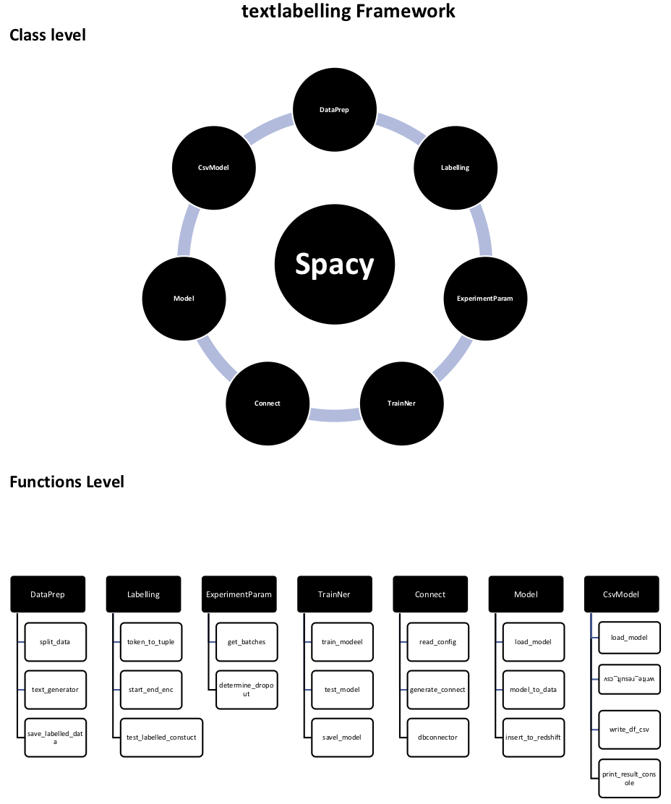

```python
%load_ext autoreload
%autoreload 2
```


```python
from src.textlabelling.dataPrep import DataPrep
from src.textlabelling.labelling import Labelling
from src.textlabelling.nerstats import NerStats
from src.textlabelling.csvmodel import CSVModel
from src.textlabelling.tainner import TrainNer, save_model, evaluate
from src.textlabelling.dbconnect import Connect
from src.textlabelling.model import Model

import random

random.seed(0)
```


```python
!pwd
```

### 1. Labelling Process
#### i. Data Labelling Container


```python
TRAIN_DATA=[]
```

#### ii. Prepare the dataset for Labelling


```python
Data_prep = DataPrep('xxxxxxxx.csv')
train, test = Data_prep.split_data()
```


```python
Data_prep.filename
```


```python
!head -n 6 xxxxxxxx.csv
```

#### iii. Label data for Training


```python
trainset = DataPrep.text_generator(train)
number = 0
n_counter = 0
def main():
    text =next(trainset)
    text = text.lower()
    print('')
    print(text)
    print('')
    Label = nerlabelling.Labelling(text)
    for item in Label.token_to_tuple():
        print(item)

    result, counter = Label.text_entities_construct()
    
    TRAIN_DATA.append(result)
    return counter
```


```python
counter = main()
number = number + 1
n_counter = n_counter + counter
#display.HTML("<p><b>Counter:</b><H1>"+str(number)+' '+str(n_counter)+"</H1></p>")
display.HTML("<table><tr><th><H1><center>Counter:</center></H1></th></tr><tr><th>Global</th><th>Internal</th></tr><tr><td><H1>"
             +str(number)+
             "</H1></td><td><H1>"
             +str(n_counter)+
             "</H1><td></tr></table>")
```

#### iv. Save Labelled data


```python
Stats = NerStats()
```


```python
Stats.save_labelled_data(data=TRAIN_DATA, file_name='labelled_data/labelleddata.pkl')
```


```python
Stats.distribution_visualizer(data)
```

#### v. Load Train data 


```python
TRAIN_DATA2 = Stats.load_labelled_data('labelled_data/labelleddat.pkl')
```

#### vi. Distribution of Labelled data


```python
data = Stats.data_distribution(TRAIN_DATA2)
data.items()
```


```python
#### v. Fix Training data 
```


```python
for idx, value in enumerate(TRAIN_DATA2):
    if idx == 1236:
        #if 'payments' in value[1]['entities'][0]:
            #print(idx,  value[1]['entities'])
             print(idx,  value)
```


```python
TRAIN_DATA2[114] = ('xxxxxxxxxxxxxxxxxxxxxxxxxxxxxxxxxxxxxxxxxxxx', {'entities': [(0, 29, 'Payments'), (116, 128, 'Payments')]})
```

### 2. Training Process
#### i. Train Model


```python
model = 'model_vi'
n_accuracy = {}
```


```python
Trainer = TrainNer(TRAIN_DATA2, n_iter=150)
nlp,losses = Trainer.train_model()
#n_accuracy[model]=100-losses['ner']
```

#### ii. Save Model


```python
type(nlp)
```


```python
NerStats.save_model(nlp, model)
```


```python
n_accuracy
```

### 3. Evaluate


```python
TEST_DATA = Stats.load_labelled_data('labelled_data/labelledtest.pkl')
```


```python
evaluate(nlp, TEST_DATA)
```


```python
### 4. 

```

### 3. TEST MODEL for PREDICTION


```python
template = """
 select created_date, reference_ticket, nps_verbatim,nps_score from table'
"""
```


```python
Model = Model('model_v1', template, 'config/config.ini','Redshift_prod')
```

#### i. Create table if it exists


```python
Model.create_table('public.nps_table')
```

#### ii. Update template 


```python
Model.template = template
```

#### iii. Insert the dataset into a table in redshift for instance


```python
Model.insert_to_redshift()
```


```python

```
